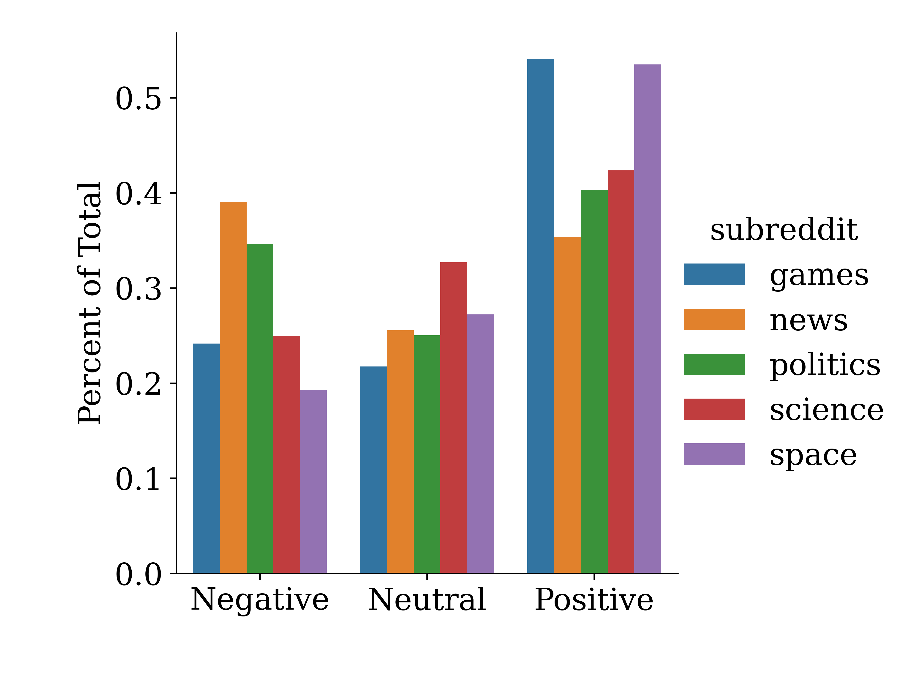
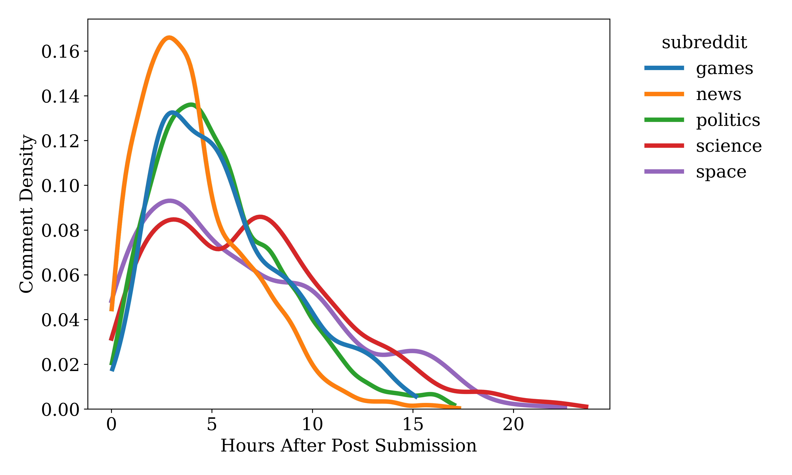

# Usage

The code is run in multiple steps:

First, obtain the relevant api keys from reddit ([instructions](https://docs.aws.amazon.com/solutions/latest/discovering-hot-topics-using-machine-learning/retrieve-and-manage-api-credentials-for-reddit-api-authentication.html)) and place them in a file named `api_keys.py` as such:

```python
client_id = 'your-client-id'
client_secret = 'your-client-key'
user_agent = 'your-app-name'
username = 'your-reddit-username'
```

Next, in `params.py`, specify the number of posts and which subreddits you wish to scrape.

After the setup is complete, successively run the following in your terminal:

```bash
python3 scrape_data.py
```

```bash
python3 compute_sentiment.py
```

Once the computation has finished, the script will generate a file called `sentiment_data.csv` which will contain all the sentiment data in addition to some other information, such as the time of posting, and the score.

## Sentiment analysis on reddit comments

Sentiment analysis is the process of programmatically extracting sentiment from text using methods from natural language processing (NLP). The primary method employed in the analysis is the characterization of a piece of text by its polarity, a label that indicates if the text was negative, neutral, or positive (there can be more gradations than these three). Sentiment analysis has been used for several years, with great success, for determining brand sentiment, user response, and more.

In this work, we look at the comments from various subreddits and compute the sentiment which provides some insight on the discourse within those subreddits.




